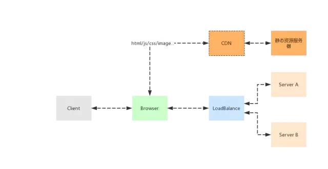
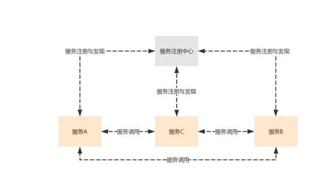

https://zhuanlan.zhihu.com/p/381847108

## **B/S+负载均衡**

后面发现把静态文件独立出来，通过CDN等手段进行加速，可以提升应用的整体相应，单体应用的架构就变成：

**B/S+前后端分离**

单体应用的根本的缺点：

代码臃肿，应用启动时间长；（代码超过1G的项目都有！）
回归测试周期长，修复一个小小bug可能都需要对所有关键业务进行回归测试。
应用容错性差，某个小小功能的程序错误可能导致整个系统宕机；
伸缩困难，单体应用扩展性能时只能整个应用进行扩展，造成计算资源浪费。
开发协作困难，一个大型应用系统，可能几十个甚至上百个开发人员，大家都在维护一套代码的话，代码merge复杂度急剧增加。

## **微服务**

在微服务架构之前还有一个概念：**SOA（Service-Oriented Architecture**）-面向服务的体系架构。我认为的SOA只是一个架构模型的方法论，并不是一个明确而严谨的架构标准，只是后面很多人将SOA与The Open Group的SOA参考模型等同了，认为严格按照TOG-SOA标准的才算真正的SOA架构。SOA就已经提出的面向服务的架构思想，所以微服务应该算是SOA的一种演进吧。

撇开架构先不说，什么样的服务才算微服务呢？

单一职责的。一个微服务应该都是单一职责的，这才是“微”的体现，一个微服务解决一个业务问题（注意是一个业务问题而不是一个接口）。
面向服务的。将自己的业务能力封装并对外提供服务，这是继承SOA的核心思想，一个微服务本身也可能使用到其它微服务的能力。 我觉得满足以上两点就可以认为典型的微服务。
微服务典型架构

微服务架构，核心是为了解决应用微服务化之后的服务治理问题。

应用微服务化之后，首先遇到的第一个问题就是**服务发现问题**，
一个微服务如何发现其他微服务呢？最简单的方式就是每个微服务里面配置其他微服务的地址，但是当微服务数量众多的时候，这样做明显不现实。所以需要使用到微服务架构中的一个最重要的组件：服务注册中心，所有服务都注册到服务注册中心，同时也可以从服务注册中心获取当前可用的服务清单：

## **服务注册中心**

解决服务发现问题后，接着需要解决微服务分布式部署带来的第二个问题：服务配置管理的问题。当服务数量超过一定程度之后，如果需要在每个服务里面分别维护每一个服务的配置文件，运维人员估计要哭了。那么，就需要用到微服务架构里面第二个重要的组件：配置中心，微服务架构就变成下面这样了：

