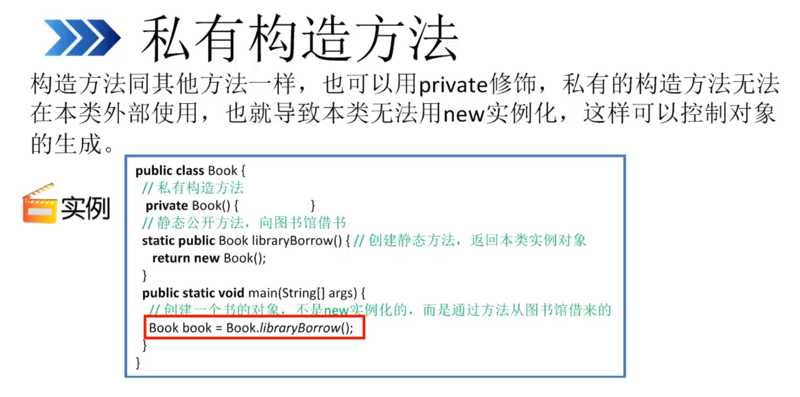

```Java

package Demo;

public class Book {
    private Book(){

    }
    static public Book libraryBorrow(){
        return new Book
    }
}
//-------------------------------------------------------

package Demo;

public class ClassTest {
    public static void main(String[] args) {
        Book book = Book.libraryBorrow();//单例设计模式；
    }
}

```
